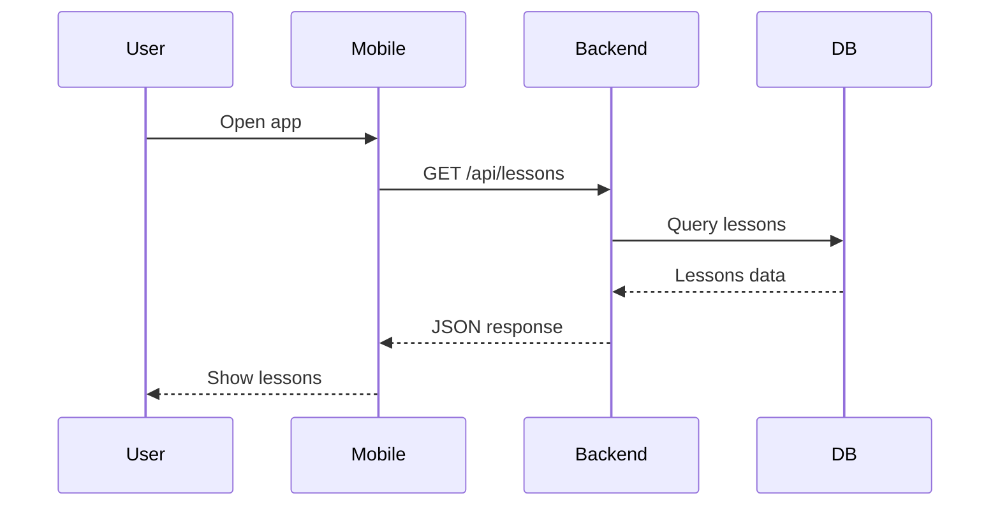

# /explain-visual - Визуальное объяснение

Создай визуальное объяснение кода или архитектуры.

## Форматы
1. **ASCII-диаграмма** - для архитектуры и потоков данных
2. **HTML-презентация** - для сложных концепций (создай файл .html)
3. **Mermaid диаграмма** - для sequence/flow диаграмм

## Что визуализировать
- Архитектура системы
- Поток данных
- Взаимодействие компонентов
- Жизненный цикл запроса
- Состояния и переходы

## Пример ASCII
```
┌─────────┐     ┌─────────┐     ┌─────────┐
│ Mobile  │────▶│ Backend │────▶│   DB    │
└─────────┘     └─────────┘     └─────────┘
     │               │
     └───────────────┴──────▶ [Leaderboard]
```

## Пример Mermaid

