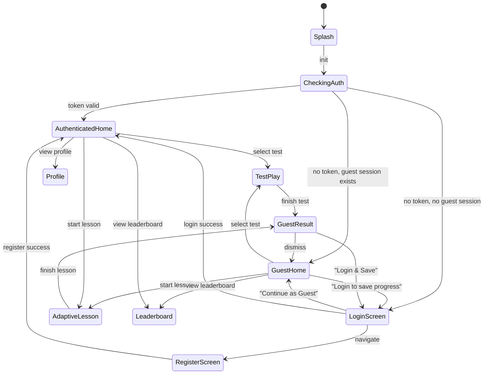
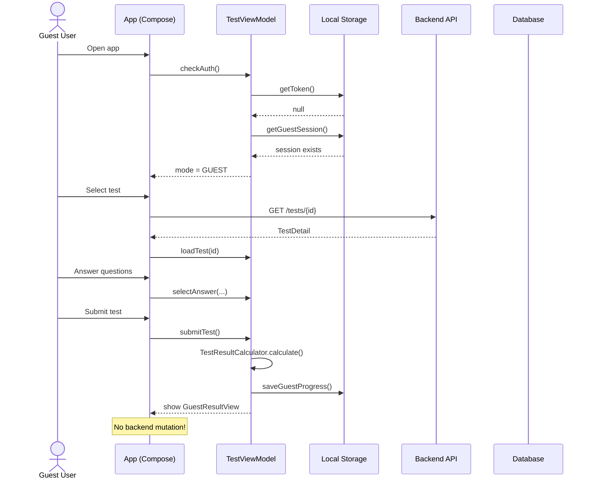
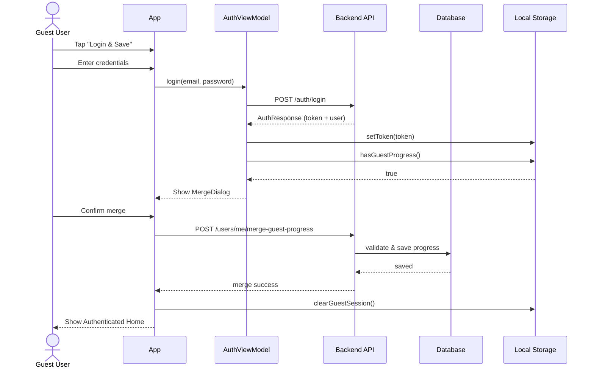

# PRD: Guest-доступ для обучения (FunnyEnglish)

## 1. Общее описание

Неавторизованные пользователи могут:
- Просматривать категории и тесты
- Проходить тесты (обычные, аудио, адаптивные уроки)
- Видеть локальный результат (звёзды, процент, XP)

НЕ могут:
- Сохранять прогресс на сервере
- Получать достижения
- Участвовать в рейтинге (leaderboard как anonymous, без своей позиции)
- Видеть персональный профиль

При авторизации система предлагает смержить локальный guest-прогресс в аккаунт.

---

## 2. State Machine: Guest Mode



---

## 3. Sequence Diagram: Guest Test Flow



---

## 4. Sequence Diagram: Post-Auth Merge



---

## 5. UI Component Hierarchy

```mermaid
graph TD
    App[App] --> AuthRouter[AuthRouter]
    AuthRouter --> LoginScreen[LoginScreen<br/>+ "Continue as Guest" button]
    AuthRouter --> RegisterScreen[RegisterScreen]
    AuthRouter --> MainAppContent[MainAppContent]
    
    MainAppContent --> Home[HomeScreen]
    MainAppContent --> Categories[CategoriesScreen]
    MainAppContent --> TestPlay[TestPlayScreen]
    MainAppContent --> AdaptiveLesson[AdaptiveLessonScreen]
    MainAppContent --> Leaderboard[LeaderboardScreen]
    MainAppContent --> Profile[ProfileScreen<br/>stub for guest]
    
    TestPlay --> GuestResult[GuestResultOverlay<br/>banner + auth CTAs]
    TestPlay --> AuthResult[AuthResultOverlay<br/>normal save]
    
    AdaptiveLesson --> GuestAdaptive[GuestAdaptiveLessonViewModel]
    AdaptiveLesson --> AuthAdaptive[AuthAdaptiveLessonViewModel]
```

---

## 6. API Contract Changes

### 6.1 New: Public Adaptive Content
```http
GET /public/adaptive/random-lesson?categoryId={uuid}&difficulty={int}
```
Response:
```json
{
  "questions": [
    {
      "id": "uuid",
      "text": "...",
      "type": "TEXT_SELECT",
      "answers": [
        { "id": "uuid", "text": "...", "isCorrect": true }
      ]
    }
  ]
}
```

### 6.2 New: Merge Guest Progress
```http
POST /users/me/merge-guest-progress
Authorization: Bearer {token}
```
Request:
```json
{
  "testProgress": [
    {
      "testId": "uuid",
      "score": 8,
      "maxScore": 10,
      "stars": 2,
      "timeSpentSeconds": 120
    }
  ],
  "xpEarned": 25
}
```
Response:
```json
{
  "mergedTests": 3,
  "totalXpAdded": 15,
  "newAchievements": [],
  "levelUp": null
}
```

---

## 7. Security Requirements

1. `POST /users/me/merge-guest-progress` — только authenticated.
2. `score` в merge request не может превышать `maxScore` теста (server-side validation).
3. Если у пользователя уже есть прогресс по тесту — берётся `max(existing, guest)`.
4. Rate limit на `/public/adaptive/random-lesson`: 30 req/min per IP.
5. Guest ID никогда не передаётся на backend.

---

## 8. Acceptance Criteria

### 8.1 Guest Mode Launch
- [ ] При отсутствии токена и наличии guest-сессии приложение открывает Home без запроса пароля.
- [ ] На экране Login видна кнопка "Продолжить без регистрации".

### 8.2 Test Taking
- [ ] Guest может пройти любой published тест.
- [ ] Результат отображается локально (звёзды, процент, XP).
- [ ] В БД backend не создаётся записи Progress для anonymous.

### 8.3 Adaptive Lessons
- [ ] Guest может загрузить случайный набор вопросов через `/public/adaptive/random-lesson`.
- [ ] Guest может проходить урок локально.
- [ ] После завершения показывается результат без сохранения на сервер.

### 8.4 Post-Auth Merge
- [ ] После успешного login/register с guest-прогрессом появляется диалог "Сохранить прогресс?".
- [ ] При согласии прогресс сохраняется в аккаунт.
- [ ] При отказе guest-прогресс остаётся локальным (до logout/очистки данных).
- [ ] Merge не перезаписывает существующие лучшие результаты пользователя.

### 8.5 Restricted Features
- [ ] Guest видит leaderboard без своей позиции.
- [ ] Guest не видит персональный профиль (stub с CTA).
- [ ] Guest не может присоединяться к группам.
