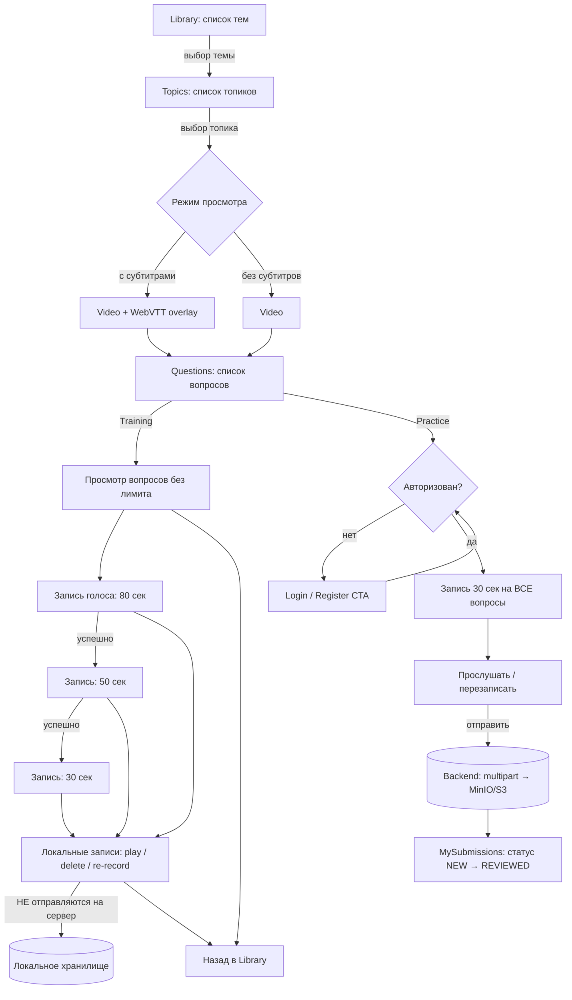
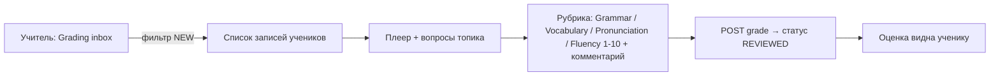
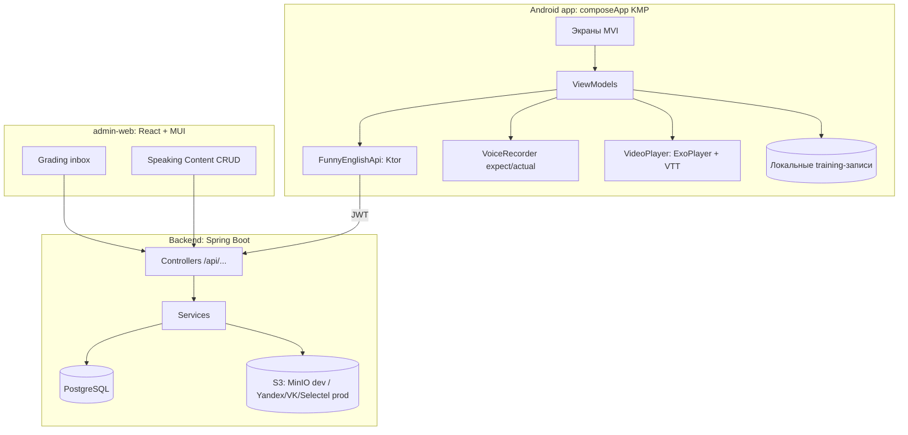

# Исследование: сервисы для схем приложения и российские варианты размещения видео

> Дата: 2026-07-30. Связано с пивотом SPEAKING-TRAINER-001.

## 1. Где рисовать схему приложения (квадратики-стрелочки)

### Вариант A — Mermaid прямо в репозитории (РЕКОМЕНДУЕТСЯ)
Схемы как код в `.md`-файлах (`docs/`): версионируются в git, генерируются и правятся AI-агентом без внешних сервисов, рендерятся на GitHub/GitLab и в IDEA (плагин Mermaid). Разумный дефолт для архитектурных схем, флоу, ERD, sequence-диаграмм. Готовые схемы нашего приложения — ниже в этом документе.

Аналогично: **PlantUML**, **D2** (тоже diagram-as-code, поддерживаются в IDEA).

### Вариант B — российские онлайн-доски (визуальная работа руками)
| Сервис | Цена | Комментарий |
|---|---|---|
| **VK Доска** (board.vk.company) | Бесплатно, без ограничений | Полный аналог Miro от VK; фигуры, стрелки, стикеры; вход через VK ID |
| **МТС Линк Доски** (mts-link.ru/products/boards) | 3 доски бесплатно; ~5400 ₽/год | Импорт из Miro в один клик, папки, команды |
| **Эсборд** (sboard.online) | 3 доски / 200 объектов бесплатно; от ~624 ₽/мес | Импорт из Miro, шаблоны, вход через VK/Яндекс ID |
| **PruffMe** (pruffme.com) | До 2 пользователей бесплатно | Доски + вебинары/курсы; российская регистрация |
| **Eldoska** | freemium | Простые учебные/рабочие доски |

### Вариант C — draw.io (diagrams.net)
Бесплатный, есть desktop-приложение (работает офлайн, файлы `.drawio` можно коммитить в репо). Не российский, но не требует аккаунта и не хранит данные у себя.

**Рекомендация:** Mermaid в `docs/` для постоянной документации + VK Доска, если нужно порисовать/обсудить руками.

## 2. Схемы приложения (Mermaid, можно сразу коммитить)

### 2.1. Пользовательский флоу (ученик)

### 2.2. Флоу учителя (admin-web)

### 2.3. Архитектура

## 3. Российские варианты размещения видео

Контекст: в PRD (SPEAKING-TRAINER-001) решено — свой хостинг через MinIO. Ниже — российские альтернативы для прода, от лучшей к рискованной.

### 3.1. S3-совместимые облака РФ + CDN (РЕКОМЕНДУЕТСЯ)
Backend-код **не меняется вообще**: MinIO/S3-клиент работает с любым S3-совместимым API — меняются только env-переменные (endpoint, ключи, `S3_PUBLIC_URL`).

| Провайдер | Хранилище | CDN | Комментарий |
|---|---|---|---|
| **Yandex Cloud** | Object Storage (~1.5 ₽/GB/мес) | Cloud CDN (~2 ₽/ГБ) | 152-ФЗ из коробки; бонус — SpeechKit (STT) для будущей авто-проверки речи |
| **VK Cloud** | Object Storage (SLA 99.95%, ЦОД РФ) | VK Cloud CDN | 152-ФЗ, документация на русском |
| **Selectel** | S3-хранилище | CDN от 2.5 ₽/ГБ (5 ГБ/мес бесплатно) | Дешёвый старт, техподдержка 24/7 |

Для видео: кладём mp4 + WebVTT в бакет, отдаём через CDN-домен — ExoPlayer играет mp4 по HTTPS напрямую, субтитры забираем файлом. **Полный контроль над плеером и субтитрами** (критично для нашего UX).

### 3.2. Kinescope (kinescope.io) — профильный видеохостинг для онлайн-школ
Российский, заточен под образование: API загрузки, адаптивный HLS-стриминг, защита от скачивания (DRM, приватные ссылки), аналитика. Плеер встраивается, но **свои субтитры поверх их плеера — ограничение** (нужна проверка: либо их субтитры через API, либо свой плеер поверх HLS-манифеста). Вариант, если захотим HLS-адаптив и защиту контента. Платный.

### 3.3. VK Видео / RuTube / Дзен — НЕ рекомендуется для этого продукта
Бесплатно, но: embed через iframe с чужим плеером (нет контроля над субтитрами и таймингом), API с ограничениями (у VK — быстро истекающие токены, у RuTube — публичное API без гарантий), модерация может удалить контент, реклама/рекомендации чужих роликов. Для учебного тренажёра с кастомным UX не подходит.

### Итоговая рекомендация
- **Dev/stage:** MinIO в docker-compose (как сейчас) — без изменений.
- **Prod:** Yandex Object Storage + Cloud CDN (или VK Cloud/Selectel — по цене/предпочтению). Миграция = смена env-переменных, т.к. S3 API одинаковый. Зафиксировать в спеке Part 1 как `S3_ENDPOINT/S3_PUBLIC_URL` — провайдер-нейтрально.
- **Kinescope** — рассмотреть позже, если появится требование DRM/адаптивного HLS.
- Диаграммы: Mermaid в репо + VK Доска для ручной работы.
